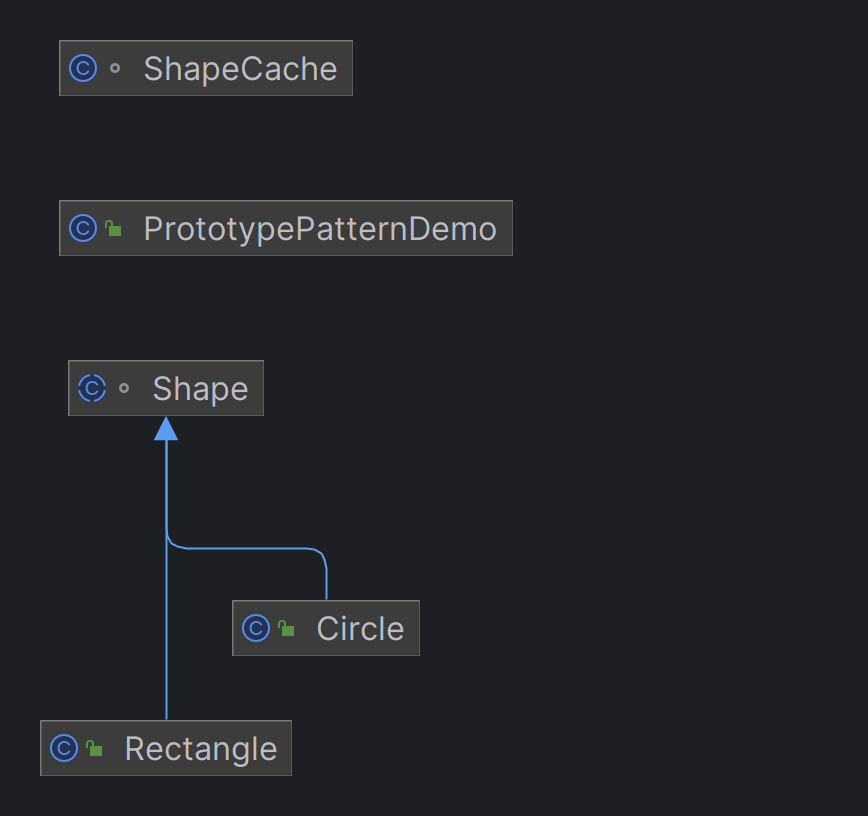

# 프로토타입 패턴(Prototype Pattern)

## 이름의 의미
- 기존 객체를 '원형(Prototype)'으로 하여, 새로운 객체를 생성하는 패턴이다. 
- 주로 객체를 복제하는 메서드를 이용해 객체를 생성합니다.

## 사용 이유
- 객체 생성 비용이 높거나 복잡한 경우, 기존 객체를 복제하여 새로운 객체를 생성하는 방식으로 성능을 최적화하고, 
- 객체의 상태를 유지하면서 새로운 객체를 빠르게 생성할 때 사용됩니다.

## 특징
- 새로운 객체를 생성하는 대신, 기존 객체를 복사하여 새로운 객체를 생성하는 패턴
- 객체를 복사할 때, **얕은 복사(shallow copy)**와, **깊은 복사(deep copy)**의 두 가지 방법을 사용

## 장점
- 복잡한 객체를 생성 시 유용하며, 복제된 객체는 기존 객체의 모든 상태를 공유
- 상속 구조를 고려할 필요 없이, 객체를 복제할 수 있어 코드의 유연성이 높아짐
- 기존 객체의 구성을 기반으로, 새로운 객체를 만들 때, 구현의 복잡성 줄일 수 있음

## 단점
- 복제된 객체의 복잡성에 따라 예상치 못한 문제 초래 가능
- 원본 객체의 복제본이 외부에서 변경되면, 원본 객체와 복제본 간의 상태가 불일치할 수 있습니다.
- 객체 복제를 위해, 객체의 상태를 관리하는 코드가 추가로 필요하므로, 코드가 복잡해질 수 있다.

```java
public Object clone() {
        Object clone = null;
        try {
            clone = super.clone();
        } catch (CloneNotSupportedException e) {
            e.printStackTrace();
        }
        return clone;
    }
```
## 왜 얕은 복사? -- super.clone() 사용
- `super.clone()`은 자바의 Object 클래스에 정의된, clone() 메서드를 호출
- 얕은 복사를 기본적으로 수행
- 얕은 복사: 객체의 모든 필드 값을 복사하지만, 만약 그 필드가 **참조형(예: 배열, 객체)**라면, 참조값만 복사한다.
- 즉, 복사된 객체의 해당 필드가 원본 객체와 같은 참조를 가리키게 된다.

## 예
- 만약, 복사하려는 객체가 int, boolean 같은 기본형 데이터 타입 필드일 경우, 이 필드들은 값 자체가 복사된다.
- 그러나, 객체나 배열 같은 참조형 데이터 타입을 필드로 가지고 있다면, 복사된 객체와 원본 객체는 같은 하위 객체(또는 배열)를 공유하게 된다.

## 정리
- 이 방법은 간단하고, 효율적이지만, 만약 객체가 복잡한 구조를 갖거나, 참조형 데이터가 변경될 경우 원본과 복사본 사이에 예상치 못한 문제가 발생할 수도 있다.

