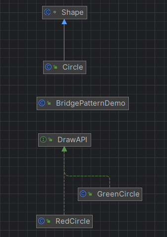

# 브리지 패턴
- 브리지 패턴: 추상화와 구현을 분리하여 두 부분을 독립적으로 확장할 수 있도록 합니다.



## 브리지 패턴에서 `protected` 사용한 이유
### 1. 상속을 통해 접근 가능
- `Shape`클래스는 추상 클래스이고, 이 클래스는 주로 서브클래스가 확장하여 사용된다.
- protected를 선언함으로써 서브클래스가 drawAPI 필드에 접근할 수 있다.
- 만약 drawAPI 필드를 private 로 선언했다면, 서브 클래스에서 이 필드에 접근할 수 없었을 것이다.
```java
package structural.bridge;

abstract class Shape {
	protected DrawAPI drawAPI;
	protected Shape(DrawAPI drawAPI) {
		this.drawAPI = drawAPI;
	}

	public abstract void draw(); // 추상 메서드
}
```
### 2. 캡슐화 유지
- protected 접근자는 외부 클래스에서 이 필드에 접근하는 것을 제한하므로, 
- Shape 클래스를 사용하는 클라이언트 코드에서 이 필드를 직접적으로 변경할 수 없다. 
- 이를 통해, 클래스의 내부 상태를 적절하게 보호하면서도, 상속받은 클래스에서 필요한 경우 직접 접근할 수 있도록 한다.
```java
abstract class Shape {
    protected DrawAPI drawAPI;

    protected Shape(DrawAPI drawAPI) {
        this.drawAPI = drawAPI;
    }

    public abstract void draw();  // 추상 메서드
}

class Circle extends Shape {
    private int x, y, radius;

    public Circle(int x, int y, int radius, DrawAPI drawAPI) {
        super(drawAPI);
        this.x = x;
        this.y = y;
        this.radius = radius;
    }

    @Override
    public void draw() {
        drawAPI.drawCircle(radius, x, y);
    }
}
```

## protected 접근 제어자 범위
### 1. 같은 클래스 내에서
- 해당 클래스 내부에서 자유롭게 접근 가능하다. private와 동일

### 2. 같은 패키지 내에서
- 같은 패키지에 속한 다른 클래스에서도 멤버에 접근 가능. 
- 이 점에서 default 접근제어자와 동일하게 동작한다.
- protected 멤버를 자유롭게 사용할 수 있게 된다.

### 3. 상속받은 클래스에서
- protected 멤버는 해당 클래스를 상속 받은 서브클래스에서도 접근할 수 있다.
- 서브 클래스가 다른 패키지에 있어도, protected 멤버에 접근이 가능하다.
- 그러나, 서브 클래스에서 직접 인스턴스를 생성하여 `부모 클래스의 protected 멤버`에 접근하는 것은 `불가능`하다.
- 접근하려면 상속을 통해 직접 접근!

### 정리
- **같은 클래스**: 접근 가능
- **같은 패키지**: 접근 가능(상속 여부 관계 없이)
- **다른 패키지의 서브 클래스**: 상속을 통해서만 접근 가능
- **다른 패키지의 비서브 클래스**: 접근 불가