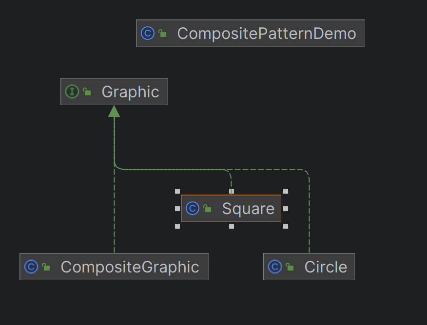

# 컴포지트 패턴(Composite pattern)
- 객체들의 트리 구조를 만들고, 단일 객체와 복합 객체를 동일하게 다룰 수 있게 해주는 패턴입니다.
- 이 패턴을 사용하면, 클라이언트는 개별 객체와 복합 객체(객체의 그룹)를 구분하지 않고 동일하게 처리할 수 있게 됩니다.




## 특징
### 트리 구조
- 컴포지트 패턴은 객체를 트리 구조로 구성하여 부분-전체 계층을 표현합니다. 
### 재귀적 구성
- 복합 객체 내에 또 다른 복합 객체를 포함시킬 수 있습니다. 
```java
package structural.composite.composite;

import java.util.ArrayList;
import java.util.List;

import structural.composite.Graphic;

public class CompositeGraphic implements Graphic {
	private List<Graphic> childGraphics = new ArrayList<>();

	
	// 하나씩 draw 실행
	@Override
	public void draw() {
		for (Graphic childGraphic : childGraphics) {
			childGraphic.draw();
		}
	}


	// 복합체에 그래픽 요소를 추가
	public void add(Graphic graphic){
		childGraphics.add(graphic);
	}

	// 복합체에서 그래픽 요소를 제거
	public void remove(Graphic graphic){
		childGraphics.remove(graphic);
	}
}

```
### 일관된 처리
```java
package structural.composite;

import structural.composite.composite.CompositeGraphic;
import structural.composite.leaf.Circle;
import structural.composite.leaf.Square;

public class CompositePatternDemo {
	public static void main(String[] args) {
		// 리프 객체 생성
		Graphic circle = new Circle();
		Graphic square = new Square();

		// 복합체 객체 생성
		CompositeGraphic composite = new CompositeGraphic();
		composite.add(circle);
		composite.add(square);

		// 복합체를 그리기
		composite.draw(); // circle과 square를 그리게 됨
	}
}

```
- 단일 객체와 복합 객체를 동일한 인터페이스로 처리할 수 있습니다.

## 장점
- 단순성: 단일 객체와, 복합 객체를 일관되게 처리할 수 있어, 클라이언트 코드를 단순화할 수 있다.
- 재귀적 구성: 복합 객체 내에 또 다른 복합 객체를 포함시킬 수 있습니다.
- 일관된 처리: 단일 객체와 복합 객체를 동일한 인터페이스로 처리가 가능합니다.

### 단점
- 복잡성 증가
- 성능 문제


## 정리
> - 컴포지트 패턴은 객체를 트리 구조로 구성하여 단일 객체와 복합 객체를 일관되게 처리할 수 있도록 해주는 패턴입니다. 
> - 복잡한 객체 계층을 관리하기에 좋지만, 구조가 복잡해질 수 있습니다.
