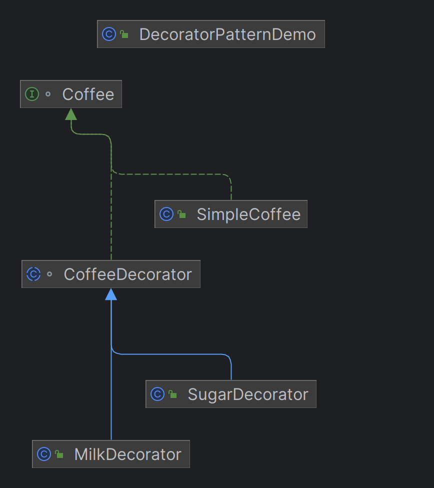

# 데코레이터 패턴(Decorator Pattern)

- 데코레이터 패턴은 객체에 추가적인 기능을 동적으로 추가할 수 있게 해주는 패턴입니다.
- 이 패턴은 상속 대신 합성을 사용하여, 기능을 확장합니다. 
- 여러 개의 데코레이터를 연결하여, 다양한 기능을 조합할 수 있습니다.

## 특징
### 1. 동적 확장
- 객체의 기능을 런타임에 동적으로 확장할 수 있다.
- SimpleCoffee 에 우유를 추가하는 데코레이터(MilkDecorator)를 감싸서, 새로운 기능을 추가할 수 있다.
```java
package structural.decorator;

// 클라이언트 코드
// 데코레이터 패턴을 사용하여 커피에 우유와 설탕을 추가해봅니다.
public class DecoratorPatternDemo {
	public static void main(String[] args) {
		Coffee simpleCoffee = new SimpleCoffee();👈
		System.out.println(simpleCoffee.getDescription() + " $" + simpleCoffee.getCost());

		Coffee milkCoffee = new MilkDecorator(simpleCoffee);👈
		System.out.println(milkCoffee.getDescription() + " $" + milkCoffee.getCost());

		Coffee milkAndSugarCoffee = new SugarDecorator(milkCoffee);
		System.out.println(milkAndSugarCoffee.getDescription() + " $" + milkAndSugarCoffee.getCost());
	}
}

```
- 이처럼 데코레이터를 사용하면, 코드 작성 시점이 아니라 프로그램 실행 시에 객체에 새로운 기능을 추가할 수 있다.
### 2. 합성
- 상속 대신, 객체 합성을 사용하여 기능을 추가합니다.
- 데코레이터 클래스는 Coffee 인터페이스를 구현하지만, 동시에 Coffee 타입의 객체를 포함한다.
```java
package structural.decorator;

// Decorator 클래스
// Coffee 인터페이스를 구현하면서, 다른 Coffee 객체를 포함합니다.
// 이는 상속 대신 합성을 통해 새로운 기능을 추가할 수 있게 합니다.
abstract class CoffeeDecorator implements Coffee{
	👉protected Coffee decoratedCoffee; // 합성: 기존 Coffee 객체를 포함

	public CoffeeDecorator(Coffee decoratedCoffee) {
		// 기존 Coffee 객체의 설명을 그대로 반환
		this.decoratedCoffee = decoratedCoffee;
	}

	@Override
	public String getDescription() {
		// 기존 Coffee 객체의 가격을 그대로 반환
		return decoratedCoffee.getDescription();
	}

	@Override
	public double getCost() {
		return decoratedCoffee.getCost();
	}
}
```
### 3. 다중 데코레이션
- 여러 데코레이터를 연결하여, 다양한 기능을 조합
- `SimpleCoffee`에 `MilkDecorator`를 적용한 후, 다시 `SugarDecorator`를 적용하여 `우유와 설탕이 추가된 커피☕`를 만들 수 있다.
- 이 방식으로 Coffee 객체에 새로운 기능을 추가할 수 있으며, 상속을 통해 기능을 확장하는 것보다 훨씬 유연하다.
- ex) MilkDecorator와 SugarDecorator를 별도로 정의하고 조합할 수 있다.
- 다중 데코레이션은 객체에 여러 단계로 기능을 추가할 수 있게 해준다. 
- 이 경우, 각 데코레이터는 독립적인 기능을 추가하여 서로 다른 조합으로 다양한 결과를 얻을 수 있다.


## 장점
- 유연성
- 단일 책임 원칙(SRP): 각 데코레이터는 하나의 추가 기능을 담당하므로, 코드가 더 모듈화됩니다.
- 런타임 적용: 데코레이터 패턴은 런타임에 객체의 기능을 추가할 수 있다.

## 단점
- 복잡성 증가
- 디버깅 어려움: 데코레이터가 중첩될 경우, 문제가 발생 시 어느 데코레이터에서 오류가 발생했는지 추적하기 어려울 수 있다.