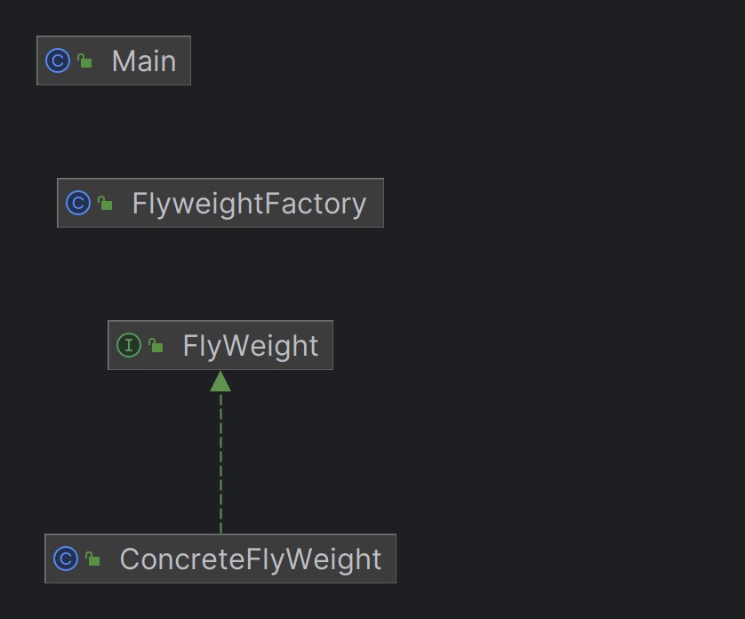

# 플라이웨이트 패턴(Flyweight Pattern)

- 대량의 유사한 객체를 효율적으로 관리하기 위해, 객체를 공유하는 디자인패턴이다. 
- 이 패턴은 메모리 절약을 위해 동일한 객체를 여러 곳에서 재사용하며, 개별 객체가 가지는 상태를 분리하여 관리합니다.

>재사용 가능한 객체 인스턴스를 공유시켜 메모리 사용량을 최소화하는 구조 패턴
>- 출처: https://inpa.tistory.com/entry/GOF-💠-Flyweight-패턴-제대로-배워보자 [Inpa Dev 👨‍💻:티스토리]

## 구조
- **내부 상태**: 객체가 공유하는 상태로, 변하지 않으며 객체 간에 공유된다.
- **외부 상태**: 객체가 개별적으로 가지는 상태로, 필요할 때마다 객체에 전달된다.

## 적용 상황
- 객체 생성 비용이 높고, 다수의 객체가 필요할 때 사용된다.
- 예를 들어, 그래픽 프로그램에서 같은 글꼴의 글자를 여러 번 사용할 때 메모리 사용을 줄이기 위해 적용할 수 있다.

### 장점
- 메모리 사용량이 크게 감소된다.
- 객체 생성 시간을 줄일 수 있다.

### 단점
- 코드가 복잡해질 수 있으며, 외부 상태관리가 까다로워질 수 있다.
- 상태를 외부로 분리하기 때문에, 객체의 사용이 더 복잡해질 수 있다.

### 예시
- 플라이웨이트 패턴은 주로 GUI 프로그램에서 반복적으로 사용되는 그래픽 객체나, 
- 게임에서 다수의 동일한 오브젝트를 표현할 때 사용된다.
- 동일한 캐릭터를 게임 화면에 다수 배치할 때, 플라이웨이트 패턴을 사용해 메모리 효율성을 극대화할 수 있다.