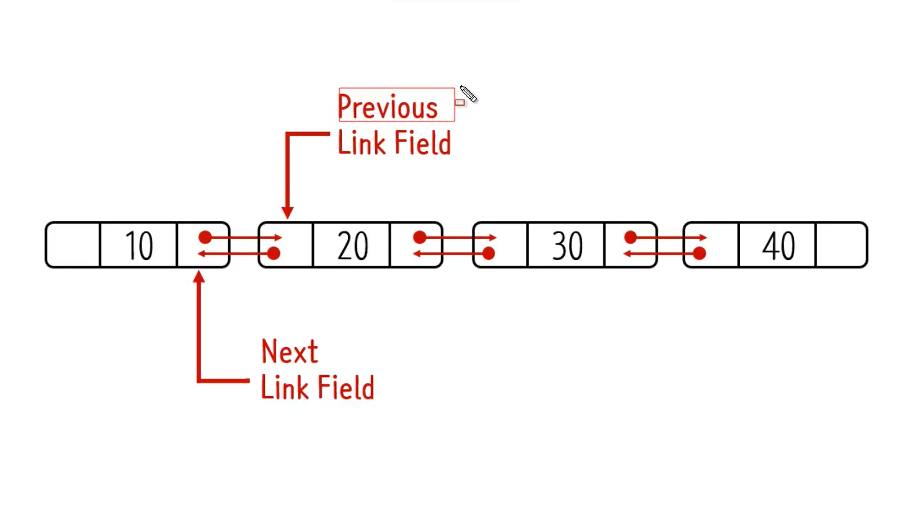
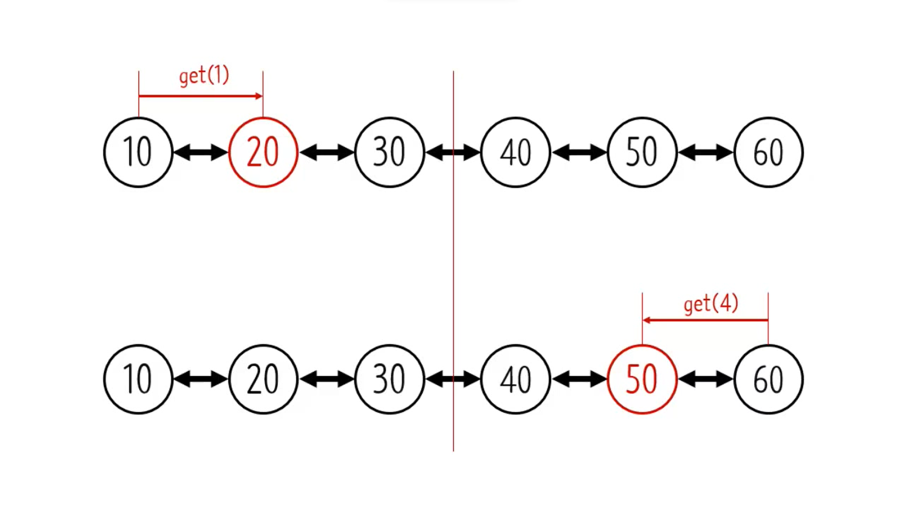
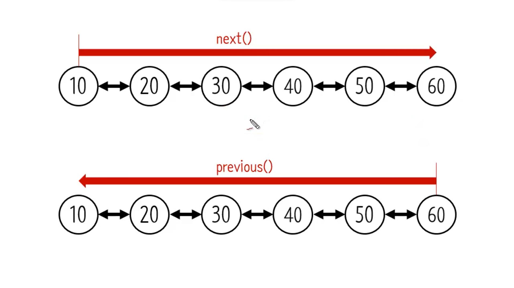
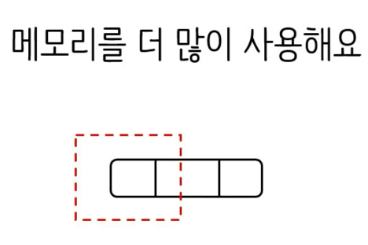
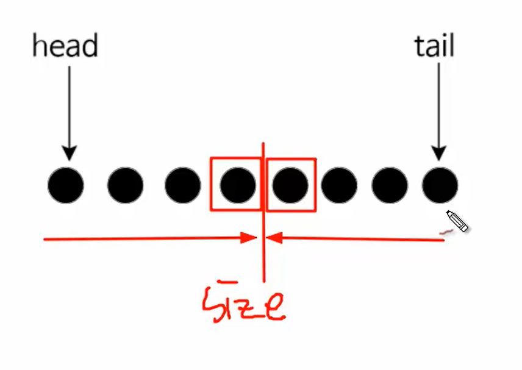

# DoublyLinkedList
## 양방향

- previous와 next 필드 존재 
- 다음 노드 및 이전 노드를 알 수 있다는 것이 중요하다.

---
## 장점 

- 조회하는 엘리먼트의 인덱스가 전체 숫자의 인덱스가 반보다 적다면 next, 크다면 previous 를 통해 빠르게 원하는 엘리먼트를 찾을 수 있다.
- linkedlist(단순 연결 리스트) 단점을 보완한 것(하나씩 다 찾아야하는)

- 양쪽에서 탐색이 가능하다. 

---
## 단점
1. 메모리를 더 많이 사용한다.
- 
2. 좀 더 복잡합니다.

## 특징
- 양방향성이 있다.
- 이전 노드에 대한 정보를 유지 -> 더 많은 데이터를 사용한다

