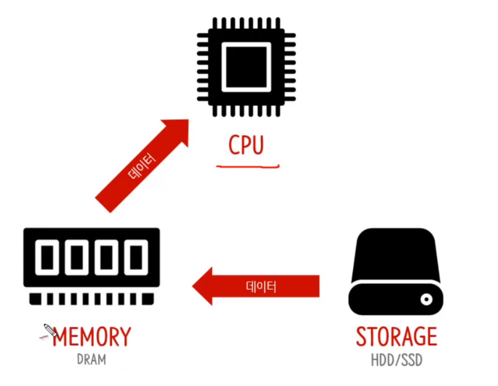
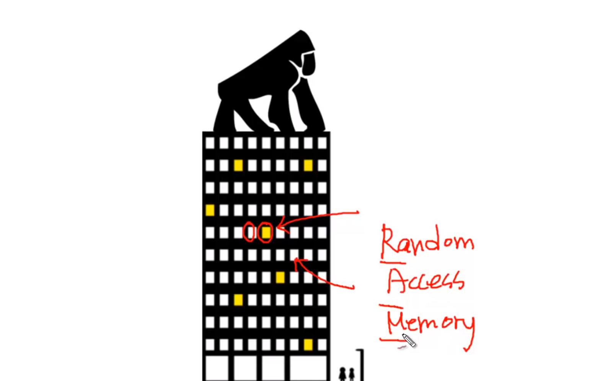
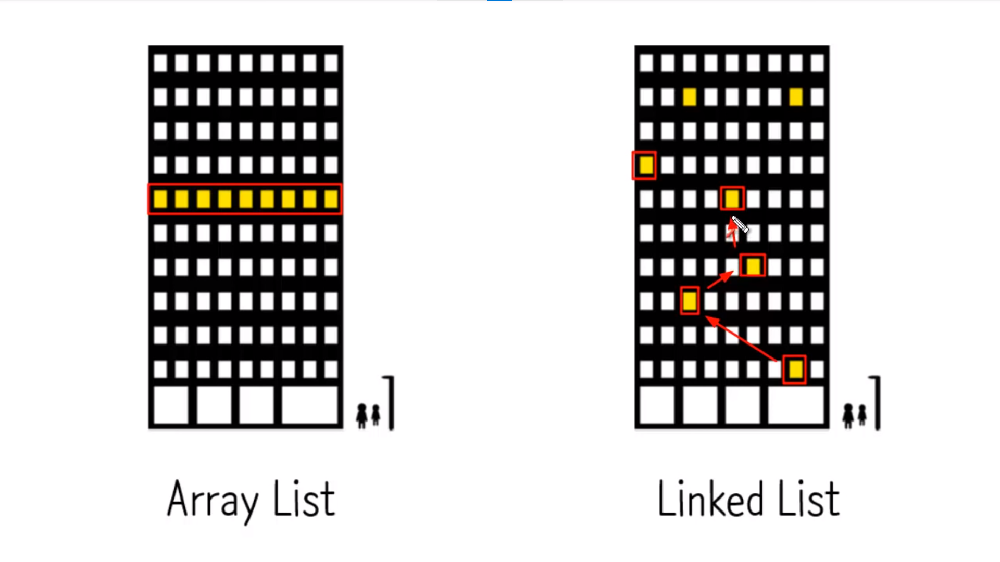
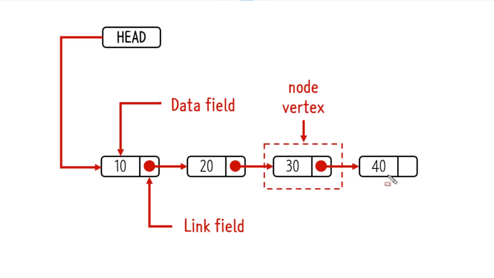
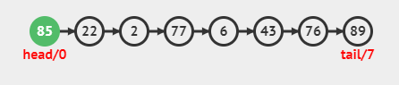
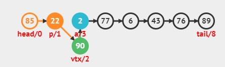

 
##  storage: 저장장치
  - 가격이 저렴하다
  - 용량이 크고 전원을 켜도 데이터가 저장되어 있다

## Memory 
- 가격이 비싼 편
- 용량이 아주 적음
- 컴퓨터를 끄면 데이터가 사라진다
- 메모리가 스토리지보다 훨씬 더 빠르게 데이터를 저장, 가져올 수 있다는 장점 

## CPU
- 처리속도가 가장 빠름 
- CPU가 어떤 데이터를 처리하고 계산할 때, storage에 저장되어 있는 것을 직접 가져다 쓰면 
- storage에게 물어보면, 2-3일 있다가 대답하는 셈. (너무 느림!
- storage에 저장되어있는 데이터를 메모리로 가져온 다음, 
- 메모리에 저장되어있는 데이터를 CPU가 가져와서 처리하여 읽음 


## Data Structure의 대상은 `메모리`
데이터 스트럭쳐의 미션은 메모리의 효율적인 사용


메모리의 중요한 특징 
- 각각의 주소에 접근할 때 걸리는 시간이 동일하다 ! -> `RANDOM ACCESS MEMORY`
## RAM
- 그 주소, 어드레스를 알고 있다면 굉장히 빠른 속도로 데이터를 가져올 수 있다.



- ArrayList : 같은 엘리먼트들이 다닥다닥 붙어있음 (연속적으로)
- LinkedList : 각각의 엘리먼트들이 흩어져있음

---

- node: 노드(마디, 교점) / vertex: 버텍스(정점, 꼭짓점)
- C와 같은 언어-> 구조체 / 객체지향 언어 -> 노드
- 2개의 필드(변수)를 갖고 있음. 
- 1) 저장되는 실제 값: 첫번째 변수 (데이터 필드) 
- 2) 링크 필드: 다음 노드가 무엇인가가 저장 
- `첫번째 노드가 무엇인지 알아야 한다` -> HEAD FIELD

> http://visualgo.net

---


```java
Vertex vtx = new Vertex(v) // 객체를 new로 만듦 v는 85, vtx 변수에 해당

vtx.next = head 
// 누가 그 리스트의 시작인가를 지정하는 변수. 85 이전에 22였을 것이다.
// next가 기존의 첫번째 노드를 가리키면 되는 것이다.
        
        
head = vtx 
// 현재 head의 값을 변경하지 않았기 때문에 vtx를 head가 가리키도록 변경하면 된다.
```
1. 노드를 생성한다.
2. next에 첫 번째 노드를 지정한다. -> next를 통해 연결되어 있기 때문에 
3. node의 시작이 되는 노드가 vtx라는 것을 지정

---


앞 주황색 : pre
파랑색 : aft
해당 insert 중간에 넣은 노드 : 초록색
```agsl
Vertex pre = head //첫번째인 노드 85를 가리킴

for (k = 0; k < i-1; k++) 

  pre = pre.next

Vertex aft = pre.next

Vertex vtx = new Vertex(v)

vtx.next = aft

pre.next = vtx
```
```agsl
Vertex temp1 = head
while(--k!=0){
 temp1 = temp1.next
 
 Vertex temp2 = temp1.next
 
 Vertex newVertex = new Vertex(input)
 
 temp1.next = newVertex
 
 newVertex.next = temp2
}
```